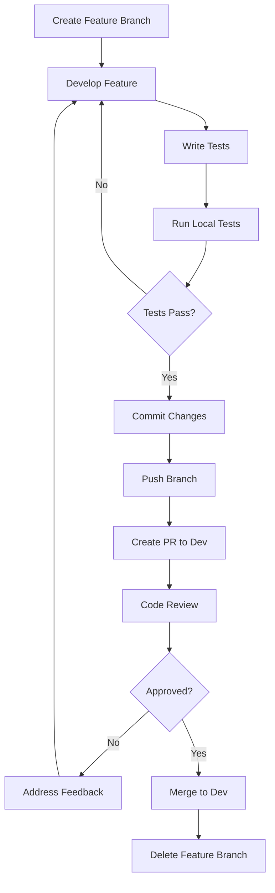
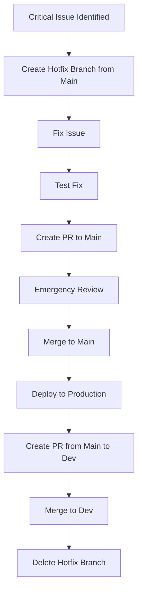
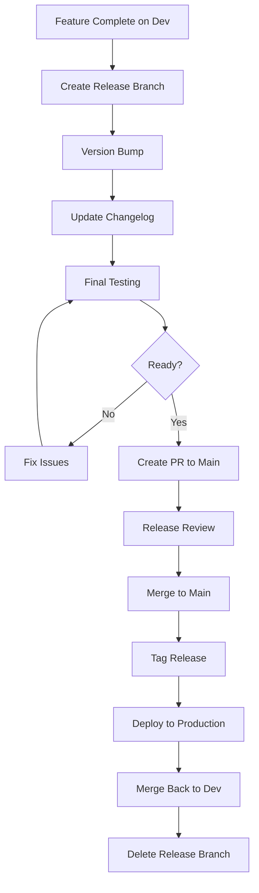

# Branch Strategy and Management

This document outlines the branching strategy, naming conventions, and management practices for the SWPP AI Application project.

## 📋 Table of Contents

- [Branching Model Overview](#branching-model-overview)
- [Branch Types](#branch-types)
- [Branch Naming Conventions](#branch-naming-conventions)
- [Workflow Processes](#workflow-processes)
- [Merge Strategies](#merge-strategies)
- [Release Management](#release-management)
- [Branch Protection Rules](#branch-protection-rules)
- [Best Practices](#best-practices)

## 🌳 Branching Model Overview

We use a **GitFlow-inspired** branching model adapted for modern development practices:


### Core Principles
1. **`main` branch**: Always production-ready
2. **`dev` branch**: Integration and testing
3. **Feature branches**: Isolated development
4. **Short-lived branches**: Quick integration cycles
5. **Protected branches**: Prevent direct pushes

## 🏷️ Branch Types

### 1. Main Branches

#### `main` Branch
- **Purpose**: Production-ready code
- **Lifetime**: Permanent
- **Protection**: Fully protected
- **Deployment**: Automatic to production
- **Merge from**: `dev` branch only (via PR)

```bash
# Never work directly on main
git checkout main
git pull origin main
# Only merge via PR
```

#### `dev` Branch  
- **Purpose**: Integration and testing
- **Lifetime**: Permanent
- **Protection**: Protected with reviews
- **Deployment**: Automatic to staging
- **Merge from**: Feature, bugfix, hotfix branches

```bash
# Keep dev updated
git checkout dev
git pull origin dev
```

### 2. Supporting Branches

#### Feature Branches (`feature/*`)
- **Purpose**: New features and enhancements
- **Lifetime**: Short-lived (1-7 days)
- **Branch from**: `dev`
- **Merge to**: `dev`
- **Naming**: `feature/description` or `feature/issue-number`

```bash
# Create feature branch
git checkout dev
git pull origin dev
git checkout -b feature/user-authentication
```

#### Bugfix Branches (`bugfix/*`)
- **Purpose**: Non-critical bug fixes
- **Lifetime**: Short-lived (1-3 days)
- **Branch from**: `dev`
- **Merge to**: `dev`
- **Naming**: `bugfix/description` or `bugfix/issue-number`

```bash
# Create bugfix branch
git checkout dev
git pull origin dev
git checkout -b bugfix/login-validation-error
```

#### Hotfix Branches (`hotfix/*`)
- **Purpose**: Critical production fixes
- **Lifetime**: Very short-lived (hours)
- **Branch from**: `main`
- **Merge to**: `main` and `dev`
- **Naming**: `hotfix/description` or `hotfix/issue-number`

```bash
# Create hotfix branch
git checkout main
git pull origin main
git checkout -b hotfix/security-vulnerability
```

#### Release Branches (`release/*`)
- **Purpose**: Prepare releases
- **Lifetime**: Short-lived (1-2 days)
- **Branch from**: `dev`
- **Merge to**: `main` and `dev`
- **Naming**: `release/version-number`

```bash
# Create release branch
git checkout dev
git pull origin dev
git checkout -b release/v1.2.0
```

## 📝 Branch Naming Conventions

### Format
```
<type>/<description>
<type>/<issue-number>-<short-description>
<type>/<component>-<description>
```

### Examples

#### Feature Branches
```bash
feature/user-authentication
feature/123-jwt-integration
feature/ui-dark-mode
feature/ai-sentiment-analysis
feature/backend-user-service
feature/frontend-navigation
```

#### Bugfix Branches
```bash
bugfix/login-validation
bugfix/456-memory-leak
bugfix/ui-button-alignment
bugfix/api-timeout-handling
bugfix/db-connection-pool
```

#### Hotfix Branches
```bash
hotfix/security-patch
hotfix/789-sql-injection
hotfix/production-crash
hotfix/payment-gateway-fix
```

#### Release Branches
```bash
release/v1.0.0
release/v1.2.0-beta
release/v2.0.0-rc1
```

### Naming Rules
1. **Use lowercase**: `feature/user-auth` not `Feature/User-Auth`
2. **Use hyphens**: `feature/user-authentication` not `feature/user_authentication`
3. **Be descriptive**: `feature/jwt-auth` not `feature/auth`
4. **Include issue number**: `feature/123-user-login` when applicable
5. **Keep it short**: Maximum 50 characters
6. **No special characters**: Avoid `/`, `\`, `@`, `#`, etc. in descriptions

## 🔄 Workflow Processes

### Feature Development Workflow



#### Step-by-Step Process
1. **Create branch from dev**:
   ```bash
   git checkout dev
   git pull origin dev
   git checkout -b feature/your-feature
   ```

2. **Develop and commit**:
   ```bash
   # Make changes
   git add .
   git commit -m "feat(component): add new functionality"
   ```

3. **Keep branch updated**:
   ```bash
   git checkout dev
   git pull origin dev
   git checkout feature/your-feature
   git rebase dev
   ```

4. **Push and create PR**:
   ```bash
   git push origin feature/your-feature
   # Create PR via GitHub UI
   ```

5. **After merge, cleanup**:
   ```bash
   git checkout dev
   git pull origin dev
   git branch -d feature/your-feature
   git push origin --delete feature/your-feature
   ```

### Hotfix Workflow



#### Hotfix Process
1. **Create hotfix branch**:
   ```bash
   git checkout main
   git pull origin main
   git checkout -b hotfix/critical-issue
   ```

2. **Fix and test**:
   ```bash
   # Make minimal fix
   git add .
   git commit -m "fix: resolve critical production issue"
   ```

3. **Merge to main**:
   ```bash
   # Create PR to main
   # Get expedited review
   # Merge and deploy
   ```

4. **Backport to dev**:
   ```bash
   # Create PR from main to dev
   # Merge to keep dev updated
   ```

### Release Workflow



## 🔀 Merge Strategies

### Strategy by Branch Type

#### Feature/Bugfix → Dev
- **Strategy**: Squash and Merge
- **Reason**: Clean history, single commit per feature
- **Command**: GitHub "Squash and merge" button

```bash
# Results in clean dev history
git log --oneline dev
# feat(auth): add JWT authentication system
# fix(ui): resolve button alignment issues
```

#### Dev → Main (Release)
- **Strategy**: Merge Commit
- **Reason**: Preserve release history
- **Command**: GitHub "Create a merge commit" button

```bash
# Preserves release points
git log --oneline main
# Merge pull request #123 from dev (Release v1.2.0)
# feat(auth): add JWT authentication system
```

#### Hotfix → Main
- **Strategy**: Merge Commit
- **Reason**: Track emergency fixes
- **Command**: GitHub "Create a merge commit" button

### Merge Requirements
- [ ] All CI checks pass
- [ ] Required reviews obtained
- [ ] No merge conflicts
- [ ] Branch is up to date
- [ ] Tests pass with >80% coverage

## 🚀 Release Management

### Release Types

#### Major Release (X.0.0)
- Breaking changes
- New major features
- Architecture changes
- **Branch**: `release/vX.0.0`
- **Timeline**: Monthly/Quarterly

#### Minor Release (X.Y.0)
- New features
- Enhancements
- Non-breaking changes
- **Branch**: `release/vX.Y.0`
- **Timeline**: Bi-weekly

#### Patch Release (X.Y.Z)
- Bug fixes
- Security patches
- Minor improvements
- **Branch**: `hotfix/vX.Y.Z` or `release/vX.Y.Z`
- **Timeline**: As needed

### Release Process

1. **Prepare Release**:
   ```bash
   git checkout dev
   git pull origin dev
   git checkout -b release/v1.2.0
   ```

2. **Version and Document**:
   ```bash
   # Update version in pyproject.toml, package.json, etc.
   # Update CHANGELOG.md
   # Update documentation
   git commit -m "chore(release): prepare v1.2.0"
   ```

3. **Test and Validate**:
   ```bash
   # Run full test suite
   # Performance testing
   # Security scanning
   ```

4. **Create Release PR**:
   ```bash
   # PR from release/v1.2.0 to main
   # Include release notes
   # Get stakeholder approval
   ```

5. **Deploy and Tag**:
   ```bash
   # Merge to main
   # Automatic deployment
   # Create git tag
   git tag -a v1.2.0 -m "Release version 1.2.0"
   git push origin v1.2.0
   ```

6. **Backport and Cleanup**:
   ```bash
   # Merge main back to dev
   # Delete release branch
   ```

## 🛡️ Branch Protection Rules

### Main Branch Protection
- ✅ Require pull request reviews (2 reviewers)
- ✅ Dismiss stale reviews when new commits are pushed
- ✅ Require review from code owners
- ✅ Require status checks to pass before merging
- ✅ Require branches to be up to date before merging
- ✅ Require conversation resolution before merging
- ✅ Restrict pushes that create files larger than 100MB
- ✅ Do not allow bypassing the above settings
- ❌ Allow force pushes
- ❌ Allow deletions

### Dev Branch Protection
- ✅ Require pull request reviews (1 reviewer)
- ✅ Require status checks to pass before merging
- ✅ Require branches to be up to date before merging
- ✅ Require conversation resolution before merging
- ❌ Allow force pushes (for maintainers only)
- ❌ Allow deletions

### Required Status Checks
- ✅ Continuous Integration (CI)
- ✅ Code Quality (Linting)
- ✅ Security Scan
- ✅ Test Coverage (>80%)
- ✅ Build Verification

## 📋 Best Practices

### Branch Management
1. **Keep branches small**: <400 lines of changes
2. **Short-lived branches**: Merge within a week
3. **Regular updates**: Rebase with target branch daily
4. **Clean history**: Use meaningful commit messages
5. **Delete merged branches**: Keep repository clean

### Collaboration
1. **Communicate early**: Share work-in-progress
2. **Review thoroughly**: Check code quality and logic
3. **Test locally**: Verify changes before pushing
4. **Document changes**: Update relevant documentation
5. **Follow conventions**: Adhere to naming and commit rules

### Conflict Resolution
1. **Rebase frequently**: Avoid large conflicts
2. **Communicate conflicts**: Discuss with team
3. **Test after resolution**: Ensure functionality
4. **Document resolution**: Note complex resolutions

### Emergency Procedures
1. **Hotfix process**: Follow established hotfix workflow
2. **Rollback plan**: Always have a rollback strategy
3. **Communication**: Notify team of emergency changes
4. **Post-mortem**: Review and improve processes

## 🔧 Automation and Tools

### GitHub Actions
- **Branch creation**: Auto-setup branch protection
- **PR validation**: Run checks on PR creation
- **Merge automation**: Auto-merge when conditions met
- **Cleanup**: Delete merged branches automatically

### Git Hooks
- **Pre-commit**: Format code and run lints
- **Commit-msg**: Validate commit message format
- **Pre-push**: Run tests before pushing

### Branch Naming Validation
```yaml
# .github/workflows/branch-naming.yml
name: Branch Naming
on:
  pull_request:
    types: [opened, synchronize]
jobs:
  check-branch-name:
    runs-on: ubuntu-latest
    steps:
      - name: Check branch name
        run: |
          if [[ ! "${{ github.head_ref }}" =~ ^(feature|bugfix|hotfix|release)/.+ ]]; then
            echo "Branch name must start with feature/, bugfix/, hotfix/, or release/"
            exit 1
          fi
```

## 📊 Monitoring and Metrics

### Branch Metrics
- Average branch lifetime
- Number of active branches
- Merge frequency
- Conflict resolution time

### Quality Metrics
- Code review coverage
- Test coverage per branch
- CI success rate
- Deployment frequency

---

**Remember**: A good branching strategy enables parallel development while maintaining code quality and stability. Follow these guidelines to ensure smooth collaboration! 🌟
