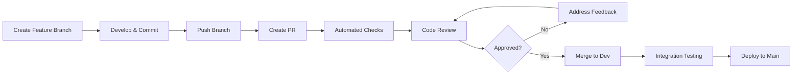

# Pull Request Rules and Guidelines

This document outlines the pull request (PR) process, standards, and best practices for the SWPP AI Application project.

## 📋 Table of Contents

- [PR Workflow Overview](#pr-workflow-overview)
- [Before Creating a PR](#before-creating-a-pr)
- [PR Title and Description](#pr-title-and-description)
- [PR Templates](#pr-templates)
- [Review Process](#review-process)
- [Merge Requirements](#merge-requirements)
- [Post-Merge Process](#post-merge-process)
- [Special PR Types](#special-pr-types)

## 🔄 PR Workflow Overview



### Branch Targets
- **Feature/Bugfix PRs**: Target `dev` branch
- **Hotfix PRs**: Target `main` branch (then merge back to `dev`)
- **Release PRs**: From `dev` to `main`

## ✅ Before Creating a PR

### Pre-PR Checklist
- [ ] Branch is up to date with target branch
- [ ] All commits follow [commit message conventions](COMMIT_RULES.md)
- [ ] Code follows [project conventions](../development/CONVENTIONS.md)
- [ ] All tests pass locally
- [ ] Code formatters have been run
- [ ] Documentation is updated
- [ ] No merge conflicts exist

### Local Validation
```bash
# Update your branch
git checkout dev
git pull origin dev
git checkout feature/your-feature
git rebase dev

# Run quality checks
make format
make lint
make test

# Verify build
make build
```

## 📝 PR Title and Description

### Title Format
Follow the same format as commit messages:
```
<type>[optional scope]: <description>
```

Examples:
```
feat(auth): add JWT token refresh mechanism
fix(ui): resolve button alignment on mobile devices
docs(api): update authentication endpoint examples
```

### Description Template
Use the provided PR template (automatically loaded):

```markdown
## Description
Brief description of changes made in this PR.

## Type of Change
- [ ] Bug fix (non-breaking change which fixes an issue)
- [ ] New feature (non-breaking change which adds functionality)
- [ ] Breaking change (fix or feature that would cause existing functionality to not work as expected)
- [ ] Documentation update
- [ ] Code refactoring
- [ ] Performance improvement
- [ ] Test addition/update

## Related Issues
- Closes #123
- Fixes #456
- Refs #789

## Changes Made
- List specific changes made
- Include any architectural decisions
- Mention any new dependencies

## Testing
- [ ] Unit tests added/updated
- [ ] Integration tests pass
- [ ] Manual testing completed
- [ ] Performance testing (if applicable)

## Screenshots (if applicable)
Include screenshots for UI changes.

## Breaking Changes
List any breaking changes and migration steps.

## Checklist
- [ ] Code follows style guidelines
- [ ] Self-review completed
- [ ] Documentation updated
- [ ] Tests added/updated
- [ ] No breaking changes (or documented)
- [ ] Commit messages follow conventions
```

## 📋 PR Templates

### Feature PR Template
```markdown
## 🚀 Feature: [Feature Name]

### Description
What does this feature do and why is it needed?

### Implementation Details
- Key architectural decisions
- New dependencies added
- Database changes (if any)

### Testing Strategy
- Unit tests coverage: X%
- Integration tests added
- Manual testing scenarios

### Documentation
- [ ] API documentation updated
- [ ] User documentation updated
- [ ] Code comments added

### Screenshots/Demo
[Include screenshots or demo links]

### Breaking Changes
None / [List breaking changes]

### Migration Guide
[If breaking changes exist, provide migration steps]
```

### Bug Fix PR Template
```markdown
## 🐛 Bug Fix: [Bug Description]

### Problem
Describe the bug that was fixed.

### Root Cause
Explain what caused the issue.

### Solution
Describe how the issue was resolved.

### Testing
- [ ] Reproducer test added
- [ ] Regression tests updated
- [ ] Manual verification completed

### Impact
- Affected components
- User impact
- Performance impact

### Related Issues
Fixes #[issue-number]
```

### Documentation PR Template
```markdown
## 📚 Documentation: [Documentation Update]

### Changes Made
- [ ] New documentation added
- [ ] Existing documentation updated
- [ ] Documentation restructured
- [ ] Typos/grammar fixed

### Scope
- [ ] API documentation
- [ ] User guides
- [ ] Developer documentation
- [ ] README updates

### Review Notes
Specific areas that need attention during review.
```

## 👥 Review Process

### Review Requirements
- **Feature PRs**: Minimum 2 reviewers
- **Bug Fix PRs**: Minimum 1 reviewer
- **Documentation PRs**: Minimum 1 reviewer
- **Hotfix PRs**: Minimum 1 senior developer

### Reviewer Responsibilities
1. **Code Quality**: Check adherence to conventions
2. **Functionality**: Verify the change works as intended
3. **Testing**: Ensure adequate test coverage
4. **Security**: Look for security vulnerabilities
5. **Performance**: Consider performance implications
6. **Documentation**: Verify documentation is updated

### Review Checklist
- [ ] Code follows project conventions
- [ ] Logic is sound and efficient
- [ ] Error handling is appropriate
- [ ] Tests are comprehensive
- [ ] Documentation is accurate
- [ ] No security vulnerabilities
- [ ] Performance is acceptable
- [ ] Breaking changes are documented

### Review Comments
Use these prefixes for clarity:
- **MUST**: Required changes before merge
- **SHOULD**: Recommended changes
- **COULD**: Optional suggestions
- **QUESTION**: Clarification needed
- **PRAISE**: Positive feedback

Example:
```
MUST: Add error handling for null user input
SHOULD: Consider extracting this logic to a separate function
COULD: This could be optimized using a map instead of nested loops
QUESTION: Why was this approach chosen over the alternative?
PRAISE: Great test coverage for edge cases!
```

## ✅ Merge Requirements

### Automated Checks
All PRs must pass:
- [ ] Code formatting validation
- [ ] Linting checks
- [ ] Unit tests
- [ ] Integration tests
- [ ] Security scans
- [ ] Build verification

### Manual Requirements
- [ ] All review comments addressed
- [ ] Required approvals obtained
- [ ] No merge conflicts
- [ ] Branch is up to date
- [ ] Documentation updated
- [ ] Breaking changes documented

### Merge Strategies
- **Feature branches**: Squash and merge
- **Release branches**: Merge commit
- **Hotfix branches**: Merge commit

## 🔄 Post-Merge Process

### After Merge to Dev
1. **Integration Testing**: Automated tests run on dev branch
2. **Deployment**: Deploy to staging environment
3. **Validation**: Verify functionality in staging
4. **Cleanup**: Delete feature branch

### After Merge to Main
1. **Production Deployment**: Automated deployment to production
2. **Monitoring**: Watch for issues in production
3. **Tagging**: Create release tag
4. **Changelog**: Update changelog automatically

## 🚨 Special PR Types

### Hotfix PRs
For critical production issues:

1. **Create from main**: `git checkout -b hotfix/critical-issue main`
2. **Minimal changes**: Only fix the critical issue
3. **Fast-track review**: Expedited review process
4. **Merge to main**: Direct merge to main branch
5. **Backport to dev**: Merge main back to dev

Template:
```markdown
## 🚨 HOTFIX: [Critical Issue]

### Severity: HIGH/CRITICAL

### Problem
Describe the critical issue affecting production.

### Impact
- User impact
- System impact
- Business impact

### Solution
Minimal changes to resolve the issue.

### Testing
- [ ] Issue reproduction confirmed
- [ ] Fix verified in staging
- [ ] Rollback plan prepared

### Rollback Plan
Steps to rollback if issues occur.
```

### Release PRs
For merging dev to main:

```markdown
## 🚀 Release: v[version-number]

### Release Summary
Summary of changes in this release.

### Features Added
- List of new features

### Bug Fixes
- List of bug fixes

### Breaking Changes
- List of breaking changes
- Migration guide

### Testing
- [ ] Full regression testing completed
- [ ] Performance testing passed
- [ ] Security testing completed

### Deployment Plan
- Deployment schedule
- Rollback plan
- Monitoring plan
```

### Dependency Update PRs
For updating dependencies:

```markdown
## 📦 Dependencies: Update [package-name]

### Changes
- Updated [package] from v[old] to v[new]

### Reason
- Security fix
- Bug fix
- New features needed

### Testing
- [ ] All tests pass
- [ ] No breaking changes
- [ ] Performance impact assessed

### Risk Assessment
- Low/Medium/High risk
- Potential issues
- Mitigation strategies
```

## 🔧 PR Automation

### GitHub Actions
Automated workflows run on PR creation:
- Code formatting check
- Linting validation
- Test execution
- Security scanning
- Build verification

### Auto-merge Conditions
PRs can be auto-merged if:
- All checks pass
- Required reviews obtained
- No merge conflicts
- Author has auto-merge permissions

### PR Labels
Use labels for categorization:
- `type: feature` - New features
- `type: bugfix` - Bug fixes
- `type: docs` - Documentation
- `priority: high` - High priority
- `breaking-change` - Breaking changes
- `needs-review` - Needs review
- `work-in-progress` - WIP PRs

## 📊 PR Metrics

### Tracking Metrics
- PR creation to merge time
- Review response time
- Number of review cycles
- Code quality scores
- Test coverage changes

### Quality Gates
- Maximum PR size: 400 lines changed
- Minimum test coverage: 80%
- Maximum review cycles: 3
- Maximum time to merge: 48 hours

## 🚫 Common PR Mistakes

### ❌ Avoid These
- Creating PRs without testing locally
- Large PRs with multiple unrelated changes
- Vague or missing PR descriptions
- Not updating documentation
- Ignoring review feedback
- Force-pushing after reviews started
- Merging without required approvals

### ✅ Best Practices
- Keep PRs small and focused
- Write clear descriptions
- Respond to reviews promptly
- Test thoroughly before creating PR
- Update documentation
- Follow up on merged PRs

---

**Remember**: Good PRs make code review efficient and help maintain high code quality. Take time to prepare them well! 🎯
