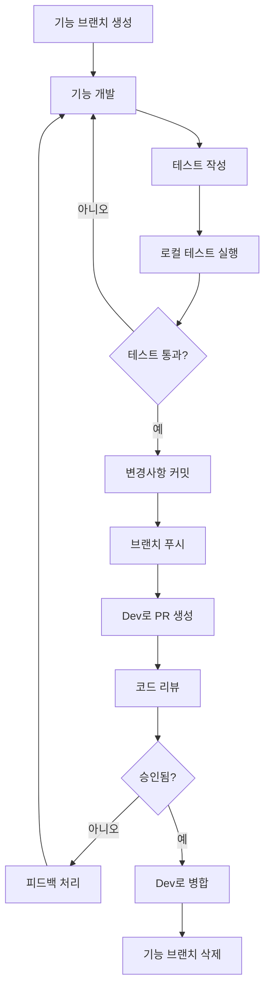
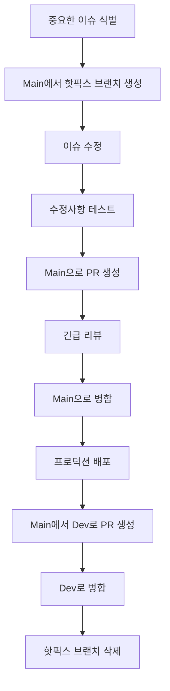
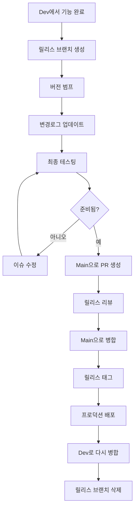

# 브랜치 전략 및 관리

이 문서는 SWPP AI Application 프로젝트의 브랜치 전략, 명명 규칙, 관리 방법을 설명합니다.

## 📋 목차

- [브랜치 모델 개요](#브랜치-모델-개요)
- [브랜치 타입](#브랜치-타입)
- [브랜치 명명 규칙](#브랜치-명명-규칙)
- [워크플로우 프로세스](#워크플로우-프로세스)
- [병합 전략](#병합-전략)
- [릴리스 관리](#릴리스-관리)
- [브랜치 보호 규칙](#브랜치-보호-규칙)
- [모범 사례](#모범-사례)

## 🌳 브랜치 모델 개요

현대적인 개발 방식에 맞게 조정된 **GitFlow 기반** 브랜치 모델을 사용합니다:


### 핵심 원칙
1. **`main` 브랜치**: 항상 프로덕션 준비 상태
2. **`dev` 브랜치**: 통합 및 테스팅
3. **기능 브랜치**: 격리된 개발
4. **단기 브랜치**: 빠른 통합 주기
5. **보호된 브랜치**: 직접 푸시 방지

## 🏷️ 브랜치 타입

### 1. 메인 브랜치

#### `main` 브랜치
- **목적**: 프로덕션 준비 코드
- **수명**: 영구
- **보호**: 완전 보호
- **배포**: 프로덕션 자동 배포
- **병합 대상**: `dev` 브랜치만 (PR을 통해)

```bash
# main에서 직접 작업하지 않음
git checkout main
git pull origin main
# PR을 통해서만 병합
```

#### `dev` 브랜치  
- **목적**: 통합 및 테스팅
- **수명**: 영구
- **보호**: 리뷰와 함께 보호
- **배포**: 스테이징 자동 배포
- **병합 대상**: 기능, 버그수정, 핫픽스 브랜치

```bash
# dev를 최신 상태로 유지
git checkout dev
git pull origin dev
```

### 2. 지원 브랜치

#### 기능 브랜치 (`feature/*`)
- **목적**: 새로운 기능 및 개선사항
- **수명**: 단기 (1-7일)
- **분기 대상**: `dev`
- **병합 대상**: `dev`
- **명명**: `feature/설명` 또는 `feature/이슈번호`

```bash
# 기능 브랜치 생성
git checkout dev
git pull origin dev
git checkout -b feature/user-authentication
```

#### 버그수정 브랜치 (`bugfix/*`)
- **목적**: 중요하지 않은 버그 수정
- **수명**: 단기 (1-3일)
- **분기 대상**: `dev`
- **병합 대상**: `dev`
- **명명**: `bugfix/설명` 또는 `bugfix/이슈번호`

```bash
# 버그수정 브랜치 생성
git checkout dev
git pull origin dev
git checkout -b bugfix/login-validation-error
```

#### 핫픽스 브랜치 (`hotfix/*`)
- **목적**: 중요한 프로덕션 수정
- **수명**: 매우 단기 (몇 시간)
- **분기 대상**: `main`
- **병합 대상**: `main`과 `dev`
- **명명**: `hotfix/설명` 또는 `hotfix/이슈번호`

```bash
# 핫픽스 브랜치 생성
git checkout main
git pull origin main
git checkout -b hotfix/security-vulnerability
```

#### 릴리스 브랜치 (`release/*`)
- **목적**: 릴리스 준비
- **수명**: 단기 (1-2일)
- **분기 대상**: `dev`
- **병합 대상**: `main`과 `dev`
- **명명**: `release/버전번호`

```bash
# 릴리스 브랜치 생성
git checkout dev
git pull origin dev
git checkout -b release/v1.2.0
```

## 📝 브랜치 명명 규칙

### 형식
```
<타입>/<설명>
<타입>/<이슈번호>-<간단한-설명>
<타입>/<컴포넌트>-<설명>
```

### 예시

#### 기능 브랜치
```bash
feature/user-authentication
feature/123-jwt-integration
feature/ui-dark-mode
feature/ai-sentiment-analysis
feature/backend-user-service
feature/frontend-navigation
```

#### 버그수정 브랜치
```bash
bugfix/login-validation
bugfix/456-memory-leak
bugfix/ui-button-alignment
bugfix/api-timeout-handling
bugfix/db-connection-pool
```

#### 핫픽스 브랜치
```bash
hotfix/security-patch
hotfix/789-sql-injection
hotfix/production-crash
hotfix/payment-gateway-fix
```

#### 릴리스 브랜치
```bash
release/v1.0.0
release/v1.2.0-beta
release/v2.0.0-rc1
```

### 명명 규칙
1. **소문자 사용**: `feature/user-auth` (대문자 `Feature/User-Auth` 아님)
2. **하이픈 사용**: `feature/user-authentication` (언더스코어 `feature/user_authentication` 아님)
3. **설명적으로**: `feature/jwt-auth` (모호한 `feature/auth` 아님)
4. **이슈 번호 포함**: 해당하는 경우 `feature/123-user-login`
5. **짧게 유지**: 최대 50자
6. **특수문자 금지**: 설명에 `/`, `\`, `@`, `#` 등 사용 금지

## 🔄 워크플로우 프로세스

### 기능 개발 워크플로우



#### 단계별 프로세스
1. **dev에서 브랜치 생성**:
   ```bash
   git checkout dev
   git pull origin dev
   git checkout -b feature/your-feature
   ```

2. **개발 및 커밋**:
   ```bash
   # 변경사항 작성
   git add .
   git commit -m "feat(component): 새로운 기능 추가"
   ```

3. **브랜치 최신 상태 유지**:
   ```bash
   git checkout dev
   git pull origin dev
   git checkout feature/your-feature
   git rebase dev
   ```

4. **푸시 및 PR 생성**:
   ```bash
   git push origin feature/your-feature
   # GitHub UI를 통해 PR 생성
   ```

5. **병합 후 정리**:
   ```bash
   git checkout dev
   git pull origin dev
   git branch -d feature/your-feature
   git push origin --delete feature/your-feature
   ```

### 핫픽스 워크플로우



#### 핫픽스 프로세스
1. **핫픽스 브랜치 생성**:
   ```bash
   git checkout main
   git pull origin main
   git checkout -b hotfix/critical-issue
   ```

2. **수정 및 테스트**:
   ```bash
   # 최소한의 수정
   git add .
   git commit -m "fix: 중요한 프로덕션 이슈 해결"
   ```

3. **main으로 병합**:
   ```bash
   # main으로 PR 생성
   # 신속한 리뷰 받기
   # 병합 및 배포
   ```

4. **dev로 백포트**:
   ```bash
   # main에서 dev로 PR 생성
   # dev를 최신 상태로 유지하기 위해 병합
   ```

### 릴리스 워크플로우



## 🔀 병합 전략

### 브랜치 타입별 전략

#### 기능/버그수정 → Dev
- **전략**: Squash and Merge
- **이유**: 깔끔한 히스토리, 기능당 단일 커밋
- **명령**: GitHub "Squash and merge" 버튼

```bash
# 깔끔한 dev 히스토리 결과
git log --oneline dev
# feat(auth): JWT 인증 시스템 추가
# fix(ui): 버튼 정렬 이슈 해결
```

#### Dev → Main (릴리스)
- **전략**: Merge Commit
- **이유**: 릴리스 히스토리 보존
- **명령**: GitHub "Create a merge commit" 버튼

```bash
# 릴리스 포인트 보존
git log --oneline main
# Merge pull request #123 from dev (Release v1.2.0)
# feat(auth): JWT 인증 시스템 추가
```

#### 핫픽스 → Main
- **전략**: Merge Commit
- **이유**: 긴급 수정사항 추적
- **명령**: GitHub "Create a merge commit" 버튼

### 병합 요구사항
- [ ] 모든 CI 검사 통과
- [ ] 필요한 리뷰 승인 획득
- [ ] 병합 충돌 없음
- [ ] 브랜치가 최신 상태
- [ ] 80% 이상 테스트 커버리지로 테스트 통과

## 🚀 릴리스 관리

### 릴리스 타입

#### 메이저 릴리스 (X.0.0)
- 중대한 변경사항
- 새로운 주요 기능
- 아키텍처 변경
- **브랜치**: `release/vX.0.0`
- **주기**: 월간/분기별

#### 마이너 릴리스 (X.Y.0)
- 새로운 기능
- 개선사항
- 비중대 변경사항
- **브랜치**: `release/vX.Y.0`
- **주기**: 격주

#### 패치 릴리스 (X.Y.Z)
- 버그 수정
- 보안 패치
- 소규모 개선
- **브랜치**: `hotfix/vX.Y.Z` 또는 `release/vX.Y.Z`
- **주기**: 필요시

### 릴리스 프로세스

1. **릴리스 준비**:
   ```bash
   git checkout dev
   git pull origin dev
   git checkout -b release/v1.2.0
   ```

2. **버전 및 문서화**:
   ```bash
   # pyproject.toml, package.json 등에서 버전 업데이트
   # CHANGELOG.md 업데이트
   # 문서 업데이트
   git commit -m "chore(release): v1.2.0 준비"
   ```

3. **테스트 및 검증**:
   ```bash
   # 전체 테스트 스위트 실행
   # 성능 테스팅
   # 보안 스캔
   ```

4. **릴리스 PR 생성**:
   ```bash
   # release/v1.2.0에서 main으로 PR
   # 릴리스 노트 포함
   # 이해관계자 승인 받기
   ```

5. **배포 및 태그**:
   ```bash
   # main으로 병합
   # 자동 배포
   # git 태그 생성
   git tag -a v1.2.0 -m "Release version 1.2.0"
   git push origin v1.2.0
   ```

6. **백포트 및 정리**:
   ```bash
   # main을 dev로 다시 병합
   # 릴리스 브랜치 삭제
   ```

## 🛡️ 브랜치 보호 규칙

### Main 브랜치 보호
- ✅ 풀 리퀘스트 리뷰 필요 (리뷰어 2명)
- ✅ 새 커밋 푸시 시 오래된 리뷰 무효화
- ✅ 코드 소유자 리뷰 필요
- ✅ 병합 전 상태 검사 통과 필요
- ✅ 병합 전 브랜치 최신 상태 필요
- ✅ 병합 전 대화 해결 필요
- ✅ 100MB 이상 파일 생성하는 푸시 제한
- ✅ 위 설정 우회 허용 안함
- ❌ 강제 푸시 허용 안함
- ❌ 삭제 허용 안함

### Dev 브랜치 보호
- ✅ 풀 리퀘스트 리뷰 필요 (리뷰어 1명)
- ✅ 병합 전 상태 검사 통과 필요
- ✅ 병합 전 브랜치 최신 상태 필요
- ✅ 병합 전 대화 해결 필요
- ❌ 강제 푸시 허용 안함 (관리자만)
- ❌ 삭제 허용 안함

### 필수 상태 검사
- ✅ 지속적 통합 (CI)
- ✅ 코드 품질 (린팅)
- ✅ 보안 스캔
- ✅ 테스트 커버리지 (>80%)
- ✅ 빌드 검증

## 📋 모범 사례

### 브랜치 관리
1. **브랜치를 작게 유지**: 변경사항 400줄 미만
2. **단기 브랜치**: 일주일 내 병합
3. **정기적 업데이트**: 대상 브랜치와 매일 리베이스
4. **깔끔한 히스토리**: 의미 있는 커밋 메시지 사용
5. **병합된 브랜치 삭제**: 저장소를 깔끔하게 유지

### 협업
1. **조기 소통**: 진행 중인 작업 공유
2. **철저한 리뷰**: 코드 품질과 로직 확인
3. **로컬 테스트**: 푸시 전 변경사항 검증
4. **변경사항 문서화**: 관련 문서 업데이트
5. **규칙 준수**: 명명 및 커밋 규칙 준수

### 충돌 해결
1. **자주 리베이스**: 큰 충돌 방지
2. **충돌 소통**: 팀과 충돌 논의
3. **해결 후 테스트**: 기능 확인
4. **해결 문서화**: 복잡한 해결 과정 기록

### 긴급 절차
1. **핫픽스 프로세스**: 확립된 핫픽스 워크플로우 따르기
2. **롤백 계획**: 항상 롤백 전략 준비
3. **소통**: 긴급 변경사항을 팀에 알리기
4. **사후 검토**: 프로세스 검토 및 개선

## 🔧 자동화 및 도구

### GitHub Actions
- **브랜치 생성**: 브랜치 보호 자동 설정
- **PR 검증**: PR 생성 시 검사 실행
- **병합 자동화**: 조건 충족 시 자동 병합
- **정리**: 병합된 브랜치 자동 삭제

### Git Hooks
- **Pre-commit**: 코드 포맷팅 및 린트 실행
- **Commit-msg**: 커밋 메시지 형식 검증
- **Pre-push**: 푸시 전 테스트 실행

### 브랜치 명명 검증
```yaml
# .github/workflows/branch-naming.yml
name: Branch Naming
on:
  pull_request:
    types: [opened, synchronize]
jobs:
  check-branch-name:
    runs-on: ubuntu-latest
    steps:
      - name: Check branch name
        run: |
          if [[ ! "${{ github.head_ref }}" =~ ^(feature|bugfix|hotfix|release)/.+ ]]; then
            echo "브랜치 이름은 feature/, bugfix/, hotfix/, 또는 release/로 시작해야 합니다"
            exit 1
          fi
```

## 📊 모니터링 및 메트릭

### 브랜치 메트릭
- 평균 브랜치 수명
- 활성 브랜치 수
- 병합 빈도
- 충돌 해결 시간

### 품질 메트릭
- 코드 리뷰 커버리지
- 브랜치별 테스트 커버리지
- CI 성공률
- 배포 빈도

---

**기억하세요**: 좋은 브랜치 전략은 코드 품질과 안정성을 유지하면서 병렬 개발을 가능하게 합니다. 원활한 협업을 위해 이 가이드라인을 따르세요! 🌟
