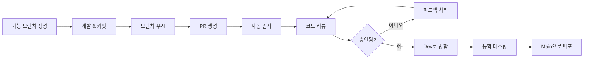

# 풀 리퀘스트 규칙 및 가이드라인

이 문서는 SWPP AI Application 프로젝트의 풀 리퀘스트(PR) 프로세스, 표준, 모범 사례를 설명합니다.

## 📋 목차

- [PR 워크플로우 개요](#pr-워크플로우-개요)
- [PR 생성 전 준비사항](#pr-생성-전-준비사항)
- [PR 제목 및 설명](#pr-제목-및-설명)
- [PR 템플릿](#pr-템플릿)
- [리뷰 프로세스](#리뷰-프로세스)
- [병합 요구사항](#병합-요구사항)
- [병합 후 프로세스](#병합-후-프로세스)
- [특수 PR 타입](#특수-pr-타입)

## 🔄 PR 워크플로우 개요



### 브랜치 대상
- **기능/버그수정 PR**: `dev` 브랜치 대상
- **핫픽스 PR**: `main` 브랜치 대상 (이후 `dev`로 병합)
- **릴리스 PR**: `dev`에서 `main`으로

## ✅ PR 생성 전 준비사항

### PR 전 체크리스트
- [ ] 브랜치가 대상 브랜치와 최신 상태
- [ ] 모든 커밋이 [커밋 메시지 규칙](COMMIT_RULES.md)을 준수
- [ ] 코드가 [프로젝트 규칙](../development/CONVENTIONS.md)을 준수
- [ ] 모든 테스트가 로컬에서 통과
- [ ] 코드 포매터가 실행됨
- [ ] 문서가 업데이트됨
- [ ] 병합 충돌이 없음

### 로컬 검증
```bash
# 브랜치 업데이트
git checkout dev
git pull origin dev
git checkout feature/your-feature
git rebase dev

# 품질 검사 실행
make format
make lint
make test

# 빌드 검증
make build
```

## 📝 PR 제목 및 설명

### 제목 형식
커밋 메시지와 동일한 형식을 따릅니다:
```
<타입>[선택적 스코프]: <설명>
```

예시:
```
feat(auth): JWT 토큰 갱신 메커니즘 추가
fix(ui): 모바일 기기에서 버튼 정렬 해결
docs(api): 인증 엔드포인트 예시 업데이트
```

### 설명 템플릿
제공된 PR 템플릿을 사용합니다 (자동으로 로드됨):

```markdown
## 설명
이 PR에서 수행된 변경사항에 대한 간단한 설명.

## 변경 타입
- [ ] 버그 수정 (기존 기능을 수정하는 비중대 변경사항)
- [ ] 새로운 기능 (기능을 추가하는 비중대 변경사항)
- [ ] 중대한 변경사항 (기존 기능이 작동하지 않게 하는 수정 또는 기능)
- [ ] 문서 업데이트
- [ ] 코드 리팩토링
- [ ] 성능 개선
- [ ] 테스트 추가/업데이트

## 관련 이슈
- Closes #123
- Fixes #456
- Refs #789

## 수행된 변경사항
- 구체적인 변경사항 나열
- 아키텍처 결정사항 포함
- 새로운 의존성 언급

## 테스팅
- [ ] 단위 테스트 추가/업데이트
- [ ] 통합 테스트 통과
- [ ] 수동 테스팅 완료
- [ ] 성능 테스팅 (해당하는 경우)

## 스크린샷 (해당하는 경우)
UI 변경사항에 대한 스크린샷 포함.

## 중대한 변경사항
중대한 변경사항과 마이그레이션 단계 나열.

## 체크리스트
- [ ] 코드가 스타일 가이드라인을 준수
- [ ] 자체 리뷰 완료
- [ ] 문서 업데이트
- [ ] 테스트 추가/업데이트
- [ ] 중대한 변경사항 없음 (또는 문서화됨)
- [ ] 커밋 메시지가 규칙을 준수
```

## 📋 PR 템플릿

### 기능 PR 템플릿
```markdown
## 🚀 기능: [기능 이름]

### 설명
이 기능이 무엇을 하며 왜 필요한가요?

### 구현 세부사항
- 주요 아키텍처 결정사항
- 추가된 새로운 의존성
- 데이터베이스 변경사항 (있는 경우)

### 테스팅 전략
- 단위 테스트 커버리지: X%
- 통합 테스트 추가
- 수동 테스팅 시나리오

### 문서
- [ ] API 문서 업데이트
- [ ] 사용자 문서 업데이트
- [ ] 코드 주석 추가

### 스크린샷/데모
[스크린샷 또는 데모 링크 포함]

### 중대한 변경사항
없음 / [중대한 변경사항 나열]

### 마이그레이션 가이드
[중대한 변경사항이 있는 경우 마이그레이션 단계 제공]
```

### 버그 수정 PR 템플릿
```markdown
## 🐛 버그 수정: [버그 설명]

### 문제
수정된 버그에 대한 설명.

### 근본 원인
이슈를 발생시킨 원인 설명.

### 해결책
이슈가 어떻게 해결되었는지 설명.

### 테스팅
- [ ] 재현 테스트 추가
- [ ] 회귀 테스트 업데이트
- [ ] 수동 검증 완료

### 영향
- 영향받는 컴포넌트
- 사용자 영향
- 성능 영향

### 관련 이슈
Fixes #[이슈번호]
```

### 문서 PR 템플릿
```markdown
## 📚 문서: [문서 업데이트]

### 수행된 변경사항
- [ ] 새로운 문서 추가
- [ ] 기존 문서 업데이트
- [ ] 문서 재구성
- [ ] 오타/문법 수정

### 범위
- [ ] API 문서
- [ ] 사용자 가이드
- [ ] 개발자 문서
- [ ] README 업데이트

### 리뷰 노트
리뷰 중 주의가 필요한 특정 영역.
```

## 👥 리뷰 프로세스

### 리뷰 요구사항
- **기능 PR**: 최소 2명의 리뷰어
- **버그 수정 PR**: 최소 1명의 리뷰어
- **문서 PR**: 최소 1명의 리뷰어
- **핫픽스 PR**: 최소 1명의 시니어 개발자

### 리뷰어 책임
1. **코드 품질**: 규칙 준수 확인
2. **기능성**: 변경사항이 의도대로 작동하는지 확인
3. **테스팅**: 적절한 테스트 커버리지 확인
4. **보안**: 보안 취약점 확인
5. **성능**: 성능 영향 고려
6. **문서**: 문서 업데이트 확인

### 리뷰 체크리스트
- [ ] 코드가 프로젝트 규칙을 준수
- [ ] 로직이 건전하고 효율적
- [ ] 적절한 오류 처리
- [ ] 포괄적인 테스트
- [ ] 정확한 문서
- [ ] 보안 취약점 없음
- [ ] 허용 가능한 성능
- [ ] 중대한 변경사항 문서화

### 리뷰 댓글
명확성을 위해 다음 접두사를 사용하세요:
- **MUST**: 병합 전 필수 변경사항
- **SHOULD**: 권장 변경사항
- **COULD**: 선택적 제안
- **QUESTION**: 명확화 필요
- **PRAISE**: 긍정적 피드백

예시:
```
MUST: null 사용자 입력에 대한 오류 처리 추가
SHOULD: 이 로직을 별도 함수로 추출하는 것을 고려
COULD: 중첩 루프 대신 맵을 사용하여 최적화 가능
QUESTION: 대안 대신 이 접근법을 선택한 이유는?
PRAISE: 엣지 케이스에 대한 훌륭한 테스트 커버리지!
```

## ✅ 병합 요구사항

### 자동 검사
모든 PR은 다음을 통과해야 합니다:
- [ ] 코드 포맷팅 검증
- [ ] 린팅 검사
- [ ] 단위 테스트
- [ ] 통합 테스트
- [ ] 보안 스캔
- [ ] 빌드 검증

### 수동 요구사항
- [ ] 모든 리뷰 댓글 처리
- [ ] 필요한 승인 획득
- [ ] 병합 충돌 없음
- [ ] 브랜치가 최신 상태
- [ ] 문서 업데이트
- [ ] 중대한 변경사항 문서화

### 병합 전략
- **기능 브랜치**: Squash and merge
- **릴리스 브랜치**: Merge commit
- **핫픽스 브랜치**: Merge commit

## 🔄 병합 후 프로세스

### Dev로 병합 후
1. **통합 테스팅**: dev 브랜치에서 자동 테스트 실행
2. **배포**: 스테이징 환경으로 배포
3. **검증**: 스테이징에서 기능 확인
4. **정리**: 기능 브랜치 삭제

### Main으로 병합 후
1. **프로덕션 배포**: 프로덕션으로 자동 배포
2. **모니터링**: 프로덕션에서 이슈 감시
3. **태깅**: 릴리스 태그 생성
4. **변경로그**: 변경로그 자동 업데이트

## 🚨 특수 PR 타입

### 핫픽스 PR
중요한 프로덕션 이슈의 경우:

1. **main에서 생성**: `git checkout -b hotfix/critical-issue main`
2. **최소한의 변경**: 중요한 이슈만 수정
3. **신속 리뷰**: 신속한 리뷰 프로세스
4. **main으로 병합**: main 브랜치로 직접 병합
5. **dev로 백포트**: main을 dev로 다시 병합

템플릿:
```markdown
## 🚨 핫픽스: [중요한 이슈]

### 심각도: HIGH/CRITICAL

### 문제
프로덕션에 영향을 주는 중요한 이슈 설명.

### 영향
- 사용자 영향
- 시스템 영향
- 비즈니스 영향

### 해결책
이슈를 해결하기 위한 최소한의 변경사항.

### 테스팅
- [ ] 이슈 재현 확인
- [ ] 스테이징에서 수정 검증
- [ ] 롤백 계획 준비

### 롤백 계획
이슈 발생 시 롤백 단계.
```

### 릴리스 PR
dev를 main으로 병합하는 경우:

```markdown
## 🚀 릴리스: v[버전번호]

### 릴리스 요약
이 릴리스의 변경사항 요약.

### 추가된 기능
- 새로운 기능 목록

### 버그 수정
- 버그 수정 목록

### 중대한 변경사항
- 중대한 변경사항 목록
- 마이그레이션 가이드

### 테스팅
- [ ] 전체 회귀 테스팅 완료
- [ ] 성능 테스팅 통과
- [ ] 보안 테스팅 완료

### 배포 계획
- 배포 일정
- 롤백 계획
- 모니터링 계획
```

### 의존성 업데이트 PR
의존성 업데이트의 경우:

```markdown
## 📦 의존성: [패키지명] 업데이트

### 변경사항
- [패키지]를 v[이전]에서 v[새버전]으로 업데이트

### 이유
- 보안 수정
- 버그 수정
- 필요한 새 기능

### 테스팅
- [ ] 모든 테스트 통과
- [ ] 중대한 변경사항 없음
- [ ] 성능 영향 평가

### 위험 평가
- 낮음/중간/높음 위험
- 잠재적 이슈
- 완화 전략
```

## 🔧 PR 자동화

### GitHub Actions
PR 생성 시 자동 워크플로우 실행:
- 코드 포맷팅 검사
- 린팅 검증
- 테스트 실행
- 보안 스캔
- 빌드 검증

### 자동 병합 조건
다음 조건에서 PR 자동 병합 가능:
- 모든 검사 통과
- 필요한 리뷰 획득
- 병합 충돌 없음
- 작성자가 자동 병합 권한 보유

### PR 라벨
분류를 위한 라벨 사용:
- `type: feature` - 새로운 기능
- `type: bugfix` - 버그 수정
- `type: docs` - 문서
- `priority: high` - 높은 우선순위
- `breaking-change` - 중대한 변경사항
- `needs-review` - 리뷰 필요
- `work-in-progress` - 진행 중인 작업

## 📊 PR 메트릭

### 추적 메트릭
- PR 생성부터 병합까지 시간
- 리뷰 응답 시간
- 리뷰 사이클 수
- 코드 품질 점수
- 테스트 커버리지 변화

### 품질 게이트
- 최대 PR 크기: 400줄 변경
- 최소 테스트 커버리지: 80%
- 최대 리뷰 사이클: 3회
- 최대 병합 시간: 48시간

## 🚫 일반적인 PR 실수

### ❌ 피해야 할 것들
- 로컬 테스트 없이 PR 생성
- 관련 없는 여러 변경사항이 포함된 큰 PR
- 모호하거나 누락된 PR 설명
- 문서 업데이트 누락
- 리뷰 피드백 무시
- 리뷰 시작 후 강제 푸시
- 필요한 승인 없이 병합

### ✅ 모범 사례
- PR을 작고 집중적으로 유지
- 명확한 설명 작성
- 리뷰에 신속하게 응답
- PR 생성 전 철저한 테스트
- 문서 업데이트
- 병합된 PR 후속 조치

---

**기억하세요**: 좋은 PR은 코드 리뷰를 효율적으로 만들고 높은 코드 품질을 유지하는 데 도움이 됩니다. 시간을 들여 잘 준비하세요! 🎯
